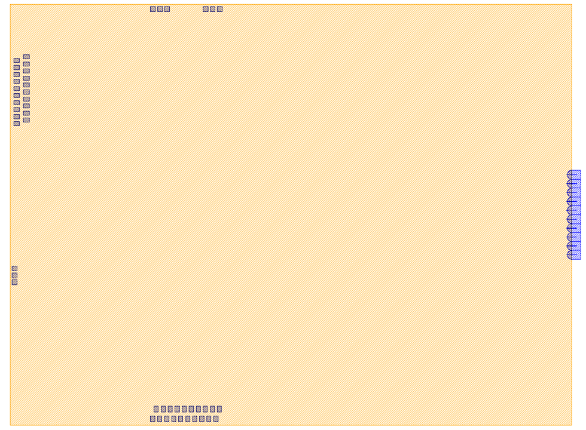

Standard_package_RF
############################

The Pinghu Standard_package_RF is a packaging solution for photonic integrated circuits (PICs). The following table shows the parameters of Pinghu Standard Package.

    * Note that after using the StandardPackage_RF a ``Standard_package_RF.log`` file is created in the current folder, send this file to **SJTU-Pinghu Institute of Intelligent Optoelectronics** first to discuss the possibilities.

+-------------------------+--------------------------------------------------------------------------------------------------------------------+
| Parameters              | Description                                                                                                        |
+=========================+====================================================================================================================+
|pic_width                | Width of PIC.                                                                                                      |
+-------------------------+--------------------------------------------------------------------------------------------------------------------+
|pic_length               | Length of PIC.                                                                                                     |
+-------------------------+--------------------------------------------------------------------------------------------------------------------+
|couplers_type            | True for EC and False for GC.                                                                                      |
+-------------------------+--------------------------------------------------------------------------------------------------------------------+
|grating_couplers_type    | True for Vertical grating coupling and False for Horizontal reflective grating coupling.                           |
+-------------------------+--------------------------------------------------------------------------------------------------------------------+
|coupler                  | For automated Coupler placement.                                                                                   |
+-------------------------+--------------------------------------------------------------------------------------------------------------------+
|couplers_number          | Max. fibers per side for 127 µm pitch: 20.                                                                         |
+-------------------------+--------------------------------------------------------------------------------------------------------------------+
|couplers_pitch           | Standard supported fiber pitches is 127 µm.                                                                        |
+-------------------------+--------------------------------------------------------------------------------------------------------------------+
|pad_DC_RF_n              |True for DC and RF signals are on the north side at the same time.                                                  |
+-------------------------+--------------------------------------------------------------------------------------------------------------------+
|pad_DC_RF_s              |True for DC and RF signals are on the south side at the same time.                                                  |
+-------------------------+--------------------------------------------------------------------------------------------------------------------+
|pad_DC_RF_w              |True for DC and RF signals are on the west side at the same time.                                                   |
+-------------------------+--------------------------------------------------------------------------------------------------------------------+
|pad_DC                   | For automated single-row and double-rows Bondpad placement.                                                        |
+-------------------------+--------------------------------------------------------------------------------------------------------------------+
|pad_DC_quad              | For automated 4-rows Bondpad placement.                                                                            |
+-------------------------+--------------------------------------------------------------------------------------------------------------------+
|pad_RF                   | For automated RF Bondpad placement.                                                                                |
+-------------------------+--------------------------------------------------------------------------------------------------------------------+
|pad_number_DC_n          | Maximum number of pads per row: 10.                                                                                |
+-------------------------+--------------------------------------------------------------------------------------------------------------------+
|pad_number_DC_s          | Maximum number of pads per row: 10.                                                                                |
+-------------------------+--------------------------------------------------------------------------------------------------------------------+
|pad_number_DC_w          | Maximum number of pads per row: 10.                                                                                |
+-------------------------+--------------------------------------------------------------------------------------------------------------------+
|pad_interval_x           |Bond pad interval: minimum interval of 10 µm for single and double rows pads.                                       |
+-------------------------+--------------------------------------------------------------------------------------------------------------------+
|pad_interval_y           |Bond pad interval: minimum interval of 30 µm for pads between double rows.                                          |
+-------------------------+--------------------------------------------------------------------------------------------------------------------+
|pad_dim_x                |Bond pad size: minimum length of 50 µm for single and double rows pads.                                             |
+-------------------------+--------------------------------------------------------------------------------------------------------------------+
|pad_dim_y                |Bond pad size: minimum width of 50 µm for single and double rows pads.                                              |
+-------------------------+--------------------------------------------------------------------------------------------------------------------+
|pad_to_edge              |Bond pad to edge: 50 µm.                                                                                            |
+-------------------------+--------------------------------------------------------------------------------------------------------------------+
|pad_interval_x_RF        |Bond pad interval: interval of 30 µm for RF signal.                                                                 |
+-------------------------+--------------------------------------------------------------------------------------------------------------------+
|pad_dim_x_RF             |Bond pad size: length of 70 µm for RF signal.                                                                       |
+-------------------------+--------------------------------------------------------------------------------------------------------------------+
|pad_dim_y_RF             |Bond pad size: width of 70 µm for RF signal.                                                                        |
+-------------------------+--------------------------------------------------------------------------------------------------------------------+
|pad_to_edge_RF           | Bond pad to edge: 30 µm for RF signal.                                                                             |
+-------------------------+--------------------------------------------------------------------------------------------------------------------+
|pad_period_RF            | Bond pad period for RF signal.                                                                                     |
+-------------------------+--------------------------------------------------------------------------------------------------------------------+
|pad_to_left_edge_n       | Distance between north Bond pad and west side.                                                                     |
+-------------------------+--------------------------------------------------------------------------------------------------------------------+
|pad_to_left_edge_s       | Distance between south Bond pad and west side.                                                                     |
+-------------------------+--------------------------------------------------------------------------------------------------------------------+
|pad_to_bot_edge_w        | Distance between west Bond pad and south side.                                                                     |
+-------------------------+--------------------------------------------------------------------------------------------------------------------+
|d_DC_to_RF_n             | Distance between DC and RF Bond pad on the north side.                                                             |
+-------------------------+--------------------------------------------------------------------------------------------------------------------+
|d_DC_to_RF_s             | Distance between DC and RF Bond pad on the south side.                                                             |
+-------------------------+--------------------------------------------------------------------------------------------------------------------+
|d_DC_to_RF_w             | Distance between DC and RF Bond pad on the west side.                                                              |
+-------------------------+--------------------------------------------------------------------------------------------------------------------+
|RF_channel_number_n      | RF channel number on the north side.                                                                               |
+-------------------------+--------------------------------------------------------------------------------------------------------------------+
|RF_channel_number_s      | RF channel number on the south side.                                                                               |
+-------------------------+--------------------------------------------------------------------------------------------------------------------+
|RF_channel_number_w      | RF channel number on the west side.                                                                                |
+-------------------------+--------------------------------------------------------------------------------------------------------------------+
|pad_interval_x_quad_rows |Bond pad interval: minimum interval of 20 µm for quadruple rows pads.                                               |
+-------------------------+--------------------------------------------------------------------------------------------------------------------+
|pad_interval_y_quad_rows |Bond pad interval: minimum interval of 30 µm for pads between quadruple rows.                                       |
+-------------------------+--------------------------------------------------------------------------------------------------------------------+
|pad_dim_x_quad_rows      |Bond pad size: minimum length of 70 µm for quadruple rows pads.                                                     |
+-------------------------+--------------------------------------------------------------------------------------------------------------------+
|pad_dim_y_quad_rows      |Bond pad size: minimum width of 70 µm for quadruple rows pads.                                                      |
+-------------------------+--------------------------------------------------------------------------------------------------------------------+
|pad_to_edge_quad_rows    |Bond pad to edge: 50 µm.                                                                                            |
+-------------------------+--------------------------------------------------------------------------------------------------------------------+
|multi_row_n              |True for multiple row of bond pad and False for single row of bond pad on the north side.                           |
+-------------------------+--------------------------------------------------------------------------------------------------------------------+
|double_row_n             |True for double row of bond pad and False for quadruple row of bond pad on the north side.                          |
+-------------------------+--------------------------------------------------------------------------------------------------------------------+
|multi_row_s              |True for multiple row of bond pad and False for single row of bond pad on the south side.                           |
+-------------------------+--------------------------------------------------------------------------------------------------------------------+
|double_row_s             |True for double row of bond pad and False for quadruple row of bond pad on the south side.                          |
+-------------------------+--------------------------------------------------------------------------------------------------------------------+
|multi_row_w              |True for multiple row of bond pad and False for single row of bond pad on the west side.                            |
+-------------------------+--------------------------------------------------------------------------------------------------------------------+
|double_row_w             |True for double row of bond pad and False for quadruple row of bond pad on the west side.                           |
+-------------------------+--------------------------------------------------------------------------------------------------------------------+

An example of the use of Edge Couplers.
********************************************

An example of the use of Grating Couplers.
********************************************

