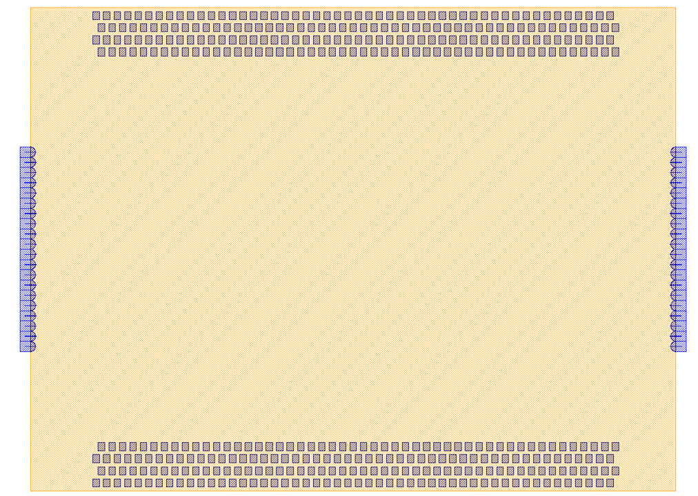
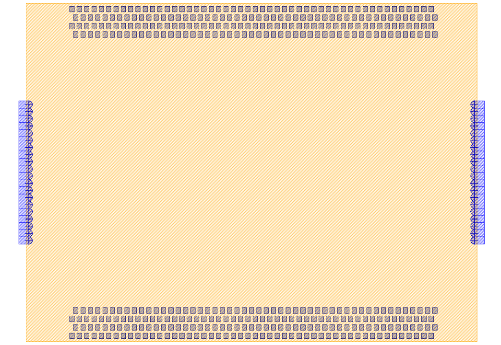

StandardPackage_Quad
############################

The Pinghu StandardPackage_Quad is a packaging solution for photonic integrated circuits (PICs). The following table shows the parameters of Pinghu Standard Package.

    * Note that after using the StandardPackage_Quad a ``Standard_package_quad.log`` file is created in the current folder, send this file to **SJTU-Pinghu Institute of Intelligent Optoelectronics** first to discuss the possibilities.

+-------------------------+------------------------------------------------------------------------------------------------------+
| Parameters              | Description                                                                                          |
+=========================+======================================================================================================+
|pic_width                | Width of PIC.                                                                                        |
+-------------------------+------------------------------------------------------------------------------------------------------+
|pic_length               | Length of PIC.                                                                                       |
+-------------------------+------------------------------------------------------------------------------------------------------+
|couplers_type            | True for EC and False for GC.                                                                        |
+-------------------------+------------------------------------------------------------------------------------------------------+
|grating_couplers_type    | True for Vertical grating coupling and False for Horizontal reflective grating coupling.             |
+-------------------------+------------------------------------------------------------------------------------------------------+
|coupler                  | For automated Coupler placement.                                                                     |
+-------------------------+------------------------------------------------------------------------------------------------------+
|couplers_number          | Max. fibers per side for 127 µm pitch: 20.                                                           |
+-------------------------+------------------------------------------------------------------------------------------------------+
|couplers_pitch           | Standard supported fiber pitches is 127 µm.                                                          |
+-------------------------+------------------------------------------------------------------------------------------------------+
|pad                      | For automated Bondpad placement.                                                                     |
+-------------------------+------------------------------------------------------------------------------------------------------+
|pad_number               | Maximum number of pads per row: 50.                                                                  |
+-------------------------+------------------------------------------------------------------------------------------------------+
|pad_interval_x_quad_rows |Bond pad interval: minimum interval of 20 µm for quadruple rows pads.                                 |
+-------------------------+------------------------------------------------------------------------------------------------------+
|pad_interval_y_quad_rows |Bond pad interval: minimum interval of 30 µm for pads between quadruple rows.                         |
+-------------------------+------------------------------------------------------------------------------------------------------+
|pad_dim_x_quad_rows      |Bond pad size: minimum length of 70 µm for quadruple rows pads.                                       |
+-------------------------+------------------------------------------------------------------------------------------------------+
|pad_dim_y_quad_rows      |Bond pad size: minimum width of 70 µm for quadruple rows pads.                                        |
+-------------------------+------------------------------------------------------------------------------------------------------+
|pad_to_edge_quad_rows    |Bond pad to edge: 50 µm.                                                                              |
+-------------------------+------------------------------------------------------------------------------------------------------+
|north_pad_shift          |North bond pad shift: positive for right sift and negative for left shift.                            |
+-------------------------+------------------------------------------------------------------------------------------------------+
|south_pad_shift          |South bond pad shift: positive for right sift and negative for left shift.                            |
+-------------------------+------------------------------------------------------------------------------------------------------+

An example of the use of Edge Couplers.
********************************************

An example of the use of Grating Couplers.
********************************************

