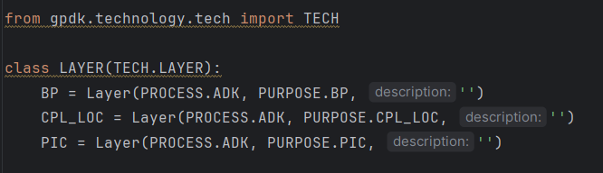

layers.py
==============

Unifies all ADK layer settings in class LAYER. The layers are auto-generated by filling the ``layers.csv`` file.

    * Note that users should change the LAYER of the ADK to be a child class of the LAYER of the PDK. Line 26 in ``layers.py`` is an example of using **gpdk**.

::

    class LAYER(TECH.LAYER):
        BP = Layer(PROCESS.ADK, PURPOSE.BP, '')
        CPL_LOC = Layer(PROCESS.ADK, PURPOSE.CPL_LOC, '')
        PIC = Layer(PROCESS.ADK, PURPOSE.PIC, '')

For users using layout viewers (e.g. KLayout), they can import the layer properties file ``layers.lyp`` in the file folder.